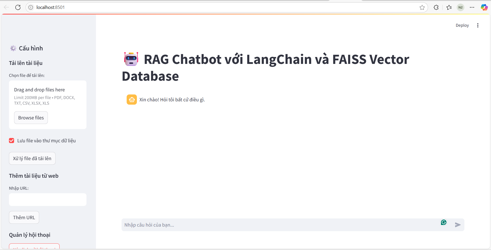

# 🤖 ChatBot RAG sử dụng LangChain, FAISS và LLaMA

Dự án xây dựng chatbot trả lời câu hỏi dựa trên tài liệu riêng của người dùng (Retrieval-Augmented Generation - RAG).  
Ứng dụng sử dụng LangChain, FAISS, HuggingFace Embeddings, và mô hình LLaMA (qua GGUF + CTransformers).

---

## 🚀 Tính năng chính

- 🔍 Nhúng tài liệu và tìm kiếm ngữ nghĩa bằng FAISS
- 🧠 Truy xuất thông tin có liên quan và sinh câu trả lời tự nhiên
- 💬 Hỗ trợ hội thoại liên tục theo ngữ cảnh
- 📦 Triển khai cục bộ, không cần gọi API ra ngoài

---

## 🛠️ Kiến trúc hệ thống



> **Pipeline:** Tài liệu đầu vào → Embedding → FAISS → LLM sinh câu trả lời

---

## 📂 Cấu trúc thư mục

```bash
RagLangchain/
├── data/                 # Thư mục chứa tài liệu nguồn (PDF, txt,...)
├── models/               # Mô hình LLaMA (.gguf dùng với CTransformers)
├── vectorstore/          # FAISS database (vector index)
├── app.py                # Script chính chạy chatbot
├── config.py             # Cấu hình hệ thống (LLM, Embedding, etc)
├── requirements.txt      # Thư viện cần cài đặt
└── README.md             # File giới thiệu dự án
